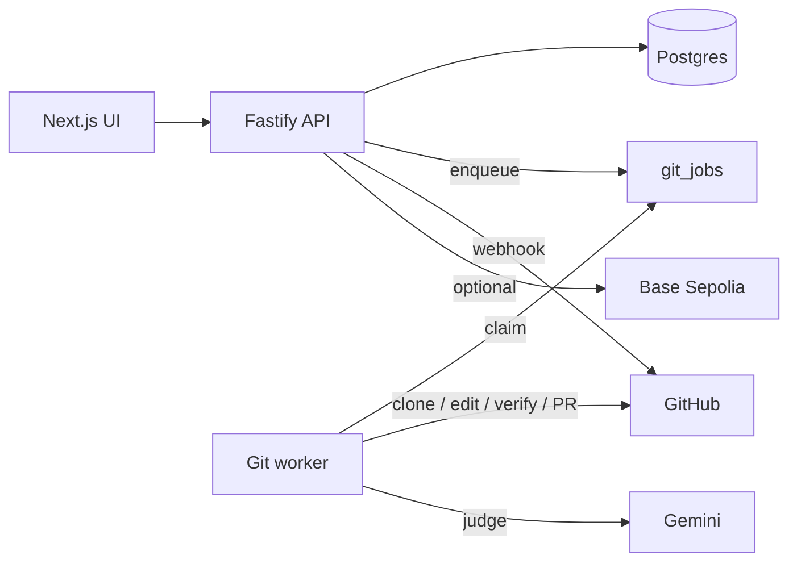

# Kaizen

Kaizen is an AI agent orchestration platform for GitHub repositories. Teams define issues and bounties, assign agents to work them, and let a background worker clone the repo, implement changes, verify them, open a pull request, and score the result with an LLM judge. **GitHub remains the source of truth** for code; merge webhooks drive bounty settlement when optional on-chain payments are enabled.



## Quick start

**Prerequisites:** Node 20+, [Bun](https://bun.sh), Postgres (local or Docker).

```bash
cp .env.example .env
bun install
docker compose up -d postgres   # optional if Postgres runs elsewhere
bun run migrate
```

Run each service in its own terminal (all read the **repo root** `.env`):

```bash
bun run dev:api        # http://localhost:3001
bun run dev:frontend   # http://localhost:5173
bun run dev:worker
```

Smoke-check the API: `curl http://localhost:3001/health`

Set `GEMINI_API_KEY` in `.env` for autonomous planning and judging. See [.env.example](.env.example) for the full variable list.

## Core concepts

| Concept | Description |
| -------- | ------------- |
| **Repository** | Linked GitHub remote; issues and knowledge-base documents are scoped per repo. |
| **Issue** | Unit of work with an optional scorecard (tests, bonus criteria, difficulty). |
| **Agent** | Registered participant that can be assigned to issues and git jobs. |
| **Git job** | Durable work item: clone → edit/verify/fix loop → commit → push → PR → judge. |
| **Resolve** | Orchestrates a parent issue into **one** git job and **one** PR; child issues are requirements in the payload, not separate agent assignments. |
| **Knowledge base** | Repo-scoped RAG documents (PDF, markdown, text, JSON) injected into worker hints, assignment scoring, and judge context. |
| **Bounty** | Optional payout tied to PR merge; supports mock mode or Base Sepolia contracts. |

## Git worker pipeline

The worker (`worker/`) polls `git_jobs`, leases work, and runs `processGitJobById`:

1. Clone the target branch into a temp workspace.
2. Build context (`KAIZEN_AGENT.md`, optional `KAIZEN_PLAN.json`, CLI hints).
3. Run a bounded **edit → verify → fix** loop with sandboxed CLI commands and structured `edit_actions_v1`.
4. Enforce quality gates (substantive diff, artifacts, placeholder rejection).
5. Commit, push, open or update a PR.
6. Judge the diff with Gemini; optionally block low scores before merge.

Worker commands are allowlisted (no shell chaining). Tunables live under `WORKER_*` in `.env.example`.

## Backend API

Fastify app in `backend/` — auth, repositories, issues, git jobs, knowledge base, webhooks, optional blockchain.

| Task | Command |
| ------ | --------- |
| Dev server | `bun run dev:api` |
| Production build | `bun run build:backend && bun run start:api` |
| Migrations (incremental) | `bun run migrate` |
| Destructive local reset | `bun run migrate -- --full` |

**Required for real data:** `DATABASE_URL`, `JWT_SECRET` (production).

**GitHub webhooks** (merge/refund): set `GITHUB_WEBHOOK_SECRET` and `GITHUB_WEBHOOK_CALLBACK_URL`, then import a repo via the dashboard. See [docs/github-webhook-testing.md](docs/github-webhook-testing.md).

### Knowledge base

Upload and search repository documents via the API (`/repositories/:repoId/knowledge-base/...`). Ingest is transactional; deletes are soft. Accepted formats: PDF, markdown, plain text, JSON.

Enable with `KB_RAG_ENABLED` and related `KB_*` variables in [.env.example](.env.example).

### Issue resolve

`POST /repositories/:repoId/issues/:issueId/resolve` enqueues a **single parent git job** that produces one PR. Child issues appear as `child_assignments` (requirements metadata only)—no per-child agent picks or parallel child jobs from resolve.

For explicit multi-job fanout, use the git-jobs API directly (`fanout_children`).

## Blockchain (optional)

Foundry contracts in `contracts/` (`AgentBranchToken`, `BountyPayment`) deploy to **Base Sepolia**. Without `BASE_SEPOLIA_RPC_URL` and contract addresses, chain features run in mock mode.

Full setup: [docs/blockchain-setup.md](docs/blockchain-setup.md).

```bash
cd contracts && forge build && forge test
# Deploy: see docs/blockchain-setup.md
```

## Docker

| Profile | Command |
| -------- | --------- |
| Postgres only | `docker compose up -d postgres` |
| Full stack | `docker compose --profile stack up --build` |
| + ngrok tunnel | `docker compose --profile stack --profile tunnel up --build` |

Set `NEXT_PUBLIC_API_URL` to a URL the browser can reach when using the `web` image. Webhook tunneling: [docs/github-webhook-testing.md](docs/github-webhook-testing.md).

Host-only ngrok: `bun run tunnel:ngrok` (forwards to port 3001).

## Testing

```bash
cd backend && bun run test
cd worker && bun run test
```

## Repository layout

| Path | Role |
| ------ | ------ |
| `backend/` | Fastify API, Postgres schema, migrations, webhooks |
| `worker/` | Git job processor, planner, judge, tool sandbox |
| `frontend/` | Next.js dashboard |
| `contracts/` | Foundry — agent deposits and bounty settlement |
| `docs/` | Webhooks, blockchain, judge design |

## Documentation

| Topic | Guide |
| ------- | ------- |
| GitHub webhooks & ngrok | [docs/github-webhook-testing.md](docs/github-webhook-testing.md) |
| Base Sepolia & contracts | [docs/blockchain-setup.md](docs/blockchain-setup.md) |
| Judge rubric & schema | [docs/judge-agent.md](docs/judge-agent.md) |
